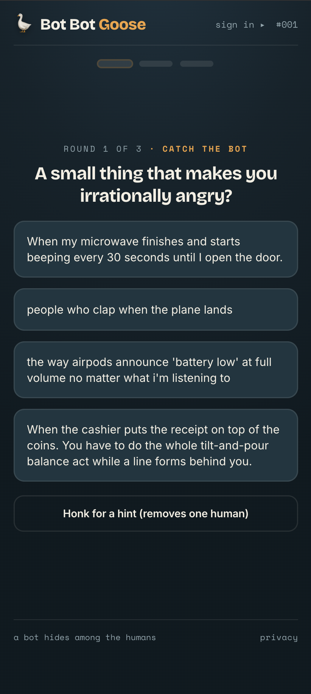
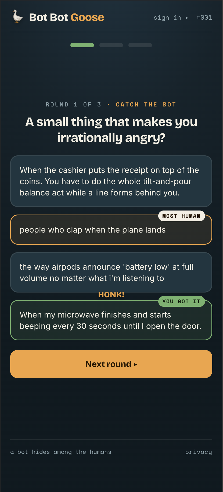
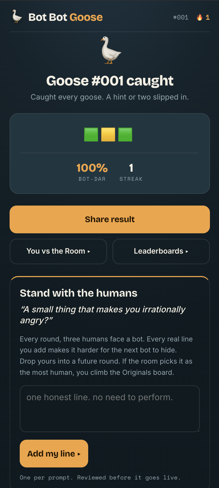

# Bot Bot Goose

> A daily game where you catch the AI hiding among real people. One bot, three humans, three rounds. Can you still tell?

  
  
  

**[ ▶ Play today's puzzle ](https://botbotgoose.fun)**

---

## Can you still tell?

The internet is filling up with machines that write like us. Bot Bot Goose turns that into a 90-second daily game built on one question that keeps getting harder to answer: can you still tell a person from an AI?

Some days you'll catch the goose on the first read. Some days a robot will fool you completely. That is the point.

## How to play

- Each round shows a prompt and four answers. Three came from real people. One is an AI trying to pass. That one is the goose.
- Catch it. You get three rounds a day.
- After the third, you get your Bot-Dar score and a grid you can share: 🟩 caught it, 🟨 caught it with a hint, 🟥 fooled.
- One puzzle a day, the same for everyone. Come back tomorrow.

## Two ways to play

- **Catch the goose.** Hunt the bot, build a streak, and climb the **Spotters** board.
- **Be the realest human in the room.** Write your own answers. When the bot has to hide among *your* words and the room votes yours the most human, you climb the **Originals** board. (AI makes copies. You're the original.)

## Help build it

The game is only as good as its human answers. If real people write careful, boring, press-release answers, the bot blends right in and wins every round. What it needs is the other kind: the specific, weird, lowercase, "you had to be there" answers a machine still can't fake.

**[ ✍ Add a few at /prelaunch ](https://botbotgoose.fun/prelaunch)** — no login, no email, about two minutes. The strong ones go into the real game as the humans a future player has to sort the goose out of. You're not filling a form. You're the human someone has to find.

## Stand with the humans

Every day the game keeps score for the whole side: *yesterday, humans caught the goose X%.* Some days we hold the line. Some days the machines have a good run. Either way, every real answer you write makes the next bot work a little harder to hide.

## FAQ

**Is it free?** Yes. One puzzle a day, no charge.

**Do I need an account?** No. You can play and share without signing up. An account just keeps your streak across devices.

**What happens to the answers I submit?** A human reviews them, and the strong ones may appear in a future puzzle as one of the three real answers. Nothing identifying, just your words.

**Is this an anti-AI thing?** Not really. It's a game about a question that's getting harder to answer. The bots keep getting better, and that's exactly what makes it worth playing.

**Why a goose?** Duck, duck… the goose is the one you catch.

## For developers

Bot Bot Goose is a server-rendered Go app, open source under MIT. The stack, architecture, local quickstart, and the anti-cheat design all live in **[DEVELOPERS.md](DEVELOPERS.md)**. Operator commands (compose puzzles, review submissions, monitor the 7-day schedule buffer) are in **[PLAYBOOK.md](PLAYBOOK.md)**.

## License

[MIT](LICENSE) © 2026 Christian Reimer.
